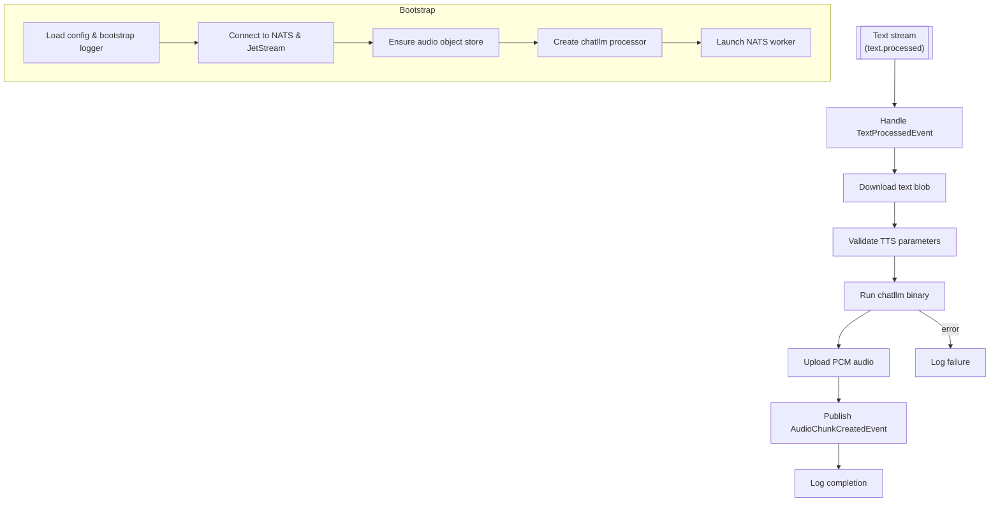

# TTS Service

## Project Summary

A NATS-based microservice that converts text to speech using the `chatllm` binary.

## Detailed Description

This service listens for `TextProcessedEvent` messages on a NATS stream. When a message is received, it downloads the text from a NATS object store, uses the `chatllm` binary to convert the text to speech, and then uploads the resulting audio to another NATS object store. For each generated audio file, it publishes an `AudioChunkCreatedEvent` to a NATS stream.

This service is the final stage in the document processing pipeline, converting the extracted and processed text into an audio format.

Core capabilities include:

-   **NATS Integration**: Seamlessly integrates with NATS for messaging and object storage.
-   **Text-to-Speech Conversion**: Utilizes the `chatllm` binary for high-quality text-to-speech synthesis.
-   **Operational Visibility**: Validates every job, logs failures with workflow context, and publishes success events for downstream consumers.

## Architecture



Key implementation touchpoints:

- `cmd/tts-service/main.go:22-206` bootstraps configuration, establishes NATS resources, and launches the worker lifecycle.
- `internal/worker/worker.go:39-256` consumes `TextProcessedEvent`, enforces validation, triggers synthesis, and publishes audio completion events.
- `internal/objectstore/nats_store.go:18-76` wraps NATS JetStream object store reads and writes for text/audio payloads.
- `internal/tts/processor.go:21-78` drives the `chatllm` binary and returns generated audio bytes.

## Technology Stack

-   **Programming Language:** Go 1.25
-   **Messaging:** NATS
-   **TTS Engine:** `chatllm`
-   **Libraries:**
    -   `github.com/nats-io/nats.go`
    -   `github.com/book-expert/configurator`
    -   `github.com/book-expert/events`
    -   `github.com/book-expert/logger`
    -   `github.com/google/uuid`
    -   `github.com/stretchr/testify`

## Getting Started

### Prerequisites

-   Go 1.25 or later.
-   NATS server with JetStream enabled.
-   The `chatllm` binary installed and available in the system's `PATH`.

### Installation

To build the service, you can use the `make build` command:

```bash
make build
```

This will create the `tts-service` binary in the `bin` directory.

### Configuration

The service requires a TOML configuration file to be accessible via a URL specified by the `PROJECT_TOML` environment variable. The configuration file should have the following structure:

```toml
[nats]
url = "nats://localhost:4222"
tts_stream_name = "tts.jobs"
tts_consumer_name = "tts-worker"
text_processed_subject = "text.processed"
audio_chunk_created_subject = "audio.chunk.created"
audio_object_store_bucket = "audio_files"

[tts_service]
model_path = "/models/voice-default.bin"
snac_model_path = "/models/snac.bin"
voice = "alloy"
allowed_voices = ["alloy", "sable"]
seed = 1234
ngl = 0
top_p = 0.95
repetition_penalty = 1.1
temperature = 0.7
timeout_seconds = 120
```

## Usage

To run the service, execute the binary:

```bash
./bin/tts-service
```

The service will connect to NATS and start listening for messages.

A successful run for each message will:

- download the referenced text artifact from the configured object store bucket
- invoke `chatllm` with the per-message TTS settings to synthesize PCM audio
- upload the PCM result to the audio bucket and publish an `AudioChunkCreatedEvent`
- log the workflow identifier alongside success or failure for observability

## Testing

To run the tests for this service, you can use the `make test` command:

```bash
make test
```

## License

Distributed under the MIT License. See the `LICENSE` file for more information.
